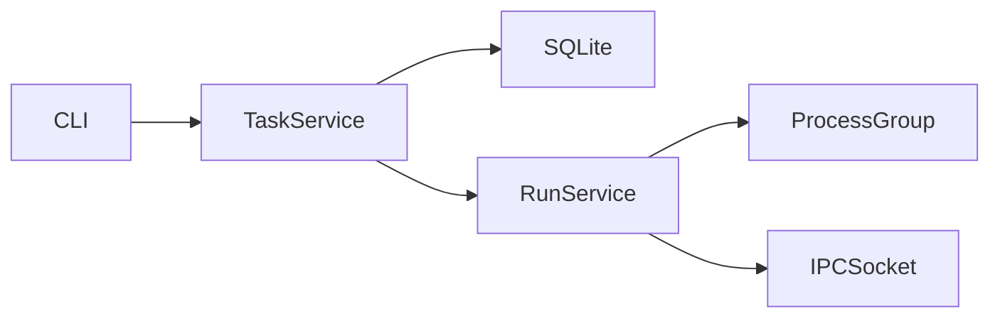

# Create Plan

Design implementation with real codebase context before breaking work into tasks.
Critical: Do NOT start implementing. Goal here: create epic + write plan file in `.fuel/plans/*.md`.

## When to Use

Use this skill when:
- Entering plan mode for new feature/workstream
- Creating an epic/spec
- Designing implementation approach before coding
- Requirements are unclear and need interview/clarification

## Mode Split (Read First)

**If `--selfguided`: stop after plan + plan commit. Do not create actionable tasks.**

Fuel auto-creates one implementation task (`Implement: <epic title>`, type `selfguided`) when the selfguided epic is created. That task loops against `- [ ]` acceptance criteria checkboxes in the plan until all are checked.

**Hard rule:** Never run `fuel-make-plan-actionable` for selfguided epics.

| Mode | Task creation | Execution model | After plan approval |
|------|---------------|-----------------|---------------------|
| `selfguided` | No manual task breakdown | Single auto-created implementation task iterates by acceptance checkboxes | Unpause epic |
| `parallel` | Convert plan into tasks | Multiple independent tasks + dependencies | Run `fuel-make-plan-actionable`, then unpause |

## Workflow

### 0. Interview

If request is unclear or missing details, ask focused questions (1-4 per round):
- Goal
- Scope (in/out)
- User impact
- Constraints (perf, compatibility, deadline)
- Integration points
- Success criteria

### 1. Read Reality

```bash
cat .fuel/reality.md
```

Look for architecture, modules, entry points, conventions, recent changes.

### 2. Explore Related Code

Find existing patterns, interfaces, and tests to mirror.

### 3. Design the Solution

Plan must include:
- Goal
- Approach
- Files to modify
- New files
- Edge cases/validation
- Testing strategy
- Acceptance criteria (machine-verifiable)
- Smoketesting approach

**Diagrams:** Use mermaid diagrams when they clarify architecture, data flow, or component relationships. A quick diagram is often clearer than three paragraphs. Good candidates:
- Multi-service or multi-process architecture
- Request/response flows with transformations
- Component dependency graphs
- State machines or lifecycle flows

Example:


If dev services needed (vite/server/workers), consider defining `.fuel/run.yml` entries.

### 4. Create Epic

Use `--selfguided` only when selfguided chosen:

```bash
fuel epic:add "Feature name" --description="What and why" [--selfguided]
```

Capture epic ID (example: `e-abc123`). Plan file auto-created at `.fuel/plans/{title-kebab}-{epic-id}.md`.

Epics start paused. Unpause only after planning flow for selected mode is ready.

### 5. Choose Execution Mode

State choice + short reason. User can override.

Prefer `selfguided` when:
- Exploratory/research-heavy
- Tightly coupled file touches
- Iterative tuning/verification required
- Hard to split into independent tasks

Prefer `parallel` when:
- Requirements clear
- Work splits into independent units
- Minimal interdependency
- Units verifiable independently

Hard rule: if you cannot define 3+ independent tasks with clean boundaries and low file overlap, choose selfguided.

### 6. Document the Plan

Write plan into epic plan file. Merge with pre-existing template sections.

For selfguided, explicit checkbox criteria is mandatory. Without `- [ ]` criteria, agent may try one pass instead of iterative loop.

Each criterion should be:
- Specific/testable
- Independent
- Measurable pass/fail

Selfguided loop behavior to make explicit in plan:
1. Execute implementation work for current criteria.
2. Mark completed criteria checkboxes.
3. Continue iterating until all criteria are checked.

### 7. Commit Plan File

```bash
git add .fuel/plans/{epic-title-kebab}-{epic-id}.md
git commit -m "plan: {epic title}"
```

### 8. Exit Plan Mode and Execute

After approval:

Selfguided:
1. Unpause epic.
2. Let single selfguided implementation task iterate against acceptance checkboxes.
3. Do not run `fuel-make-plan-actionable`.

Parallel:
1. Run `fuel-make-plan-actionable`.
2. Unpause epic.

## When Reality Doesn't Exist

If `.fuel/reality.md` is empty/stub:
- Explore code manually
- Follow similar features
- Document findings in plan

## Example Planning Session

### Example 1: Parallel
1. User asks: add notification preferences.
2. Read reality + related service/model/test files.
3. Choose parallel: clear separable units.
4. Create epic (no `--selfguided`).
5. Write + commit plan.
6. After approval: run `fuel-make-plan-actionable`, then unpause.

### Example 2: Selfguided Checkbox Loop
1. User asks: make dashboard API faster.
2. Interview to define baseline/target (`<500ms`).
3. Choose selfguided: exploratory profiling + iterative tuning.
4. Create epic: `fuel epic:add "Optimize dashboard API performance" --selfguided`
5. Write plan with explicit criteria:
   - `- [ ] Dashboard API p95 latency <500ms in benchmark`
   - `- [ ] N+1 query removed on dashboard endpoint`
   - `- [ ] Cache hit rate >80% in smoke test`
6. Commit plan.
7. After approval: unpause epic.
8. Selfguided implementation task loops until all checkboxes are checked.
9. Do not run `fuel-make-plan-actionable`.

## Complexity & Cost Optimization

Complexity drives model routing. Fuel assigns cheaper/faster agents to `trivial` and `simple` tasks.

**When designing tasks, prefer granular over monolithic:**
- One `moderate` task that could split into `simple` + `trivial` → split it
- More tasks at lower complexity = less cost, faster execution
- Only use `complex` when multiple concerns genuinely require judgement or coordination

Complexity scale: `trivial` (typos/single-line) | `simple` (single file/focus) | `moderate` (multiple files) | `complex` (multiple concerns, requires judgement)

## Parallel Mode Only: Convert to Tasks

Never run this for selfguided epics.

Once parallel plan is approved, use `fuel-make-plan-actionable` to:
- Generate task JSON and import via `fuel add:json e-xxxx /path/tasks.json`
- Set dependencies and complexity correctly
- Create mandatory review task
- Unpause epic after task graph is ready

Workflow summary:
1. `fuel-create-plan` -> design with context
2. `fuel-make-plan-actionable` -> parallel task graph only
3. `fuel unpause` -> start execution
