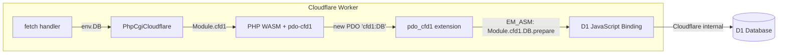

# Epic: Cloudflare D1 database support via pdo-cfd1 (e-d02b7f)

## Goal

Enable Laravel apps running on Cloudflare Workers (via laraworker) to use Cloudflare D1 as a database, using standard Laravel Eloquent/PDO. D1 is Cloudflare's serverless SQLite-compatible database — the natural persistence layer for Workers.

The `seanmorris/pdo-cfd1` extension provides a PDO driver that bridges PHP's PDO to D1's JavaScript API via Emscripten `EM_ASM` interop. It's already a package in the `seanmorris/php-wasm` monorepo (`packages/pdo-cfd1/`) with build support via `WITH_PDO_CFD1=1`.

## Architecture



### Data Flow

1. Cloudflare invokes worker's `fetch(request, env)` — `env.DB` is the D1 binding
2. Worker passes D1 binding to `PhpCgiCloudflare` constructor as `cfd1: { DB: env.DB }`
3. PhpCgiBase spreads extra args into `phpArgs` → passed to `new PHP(phpArgs)` (Emscripten module)
4. Emscripten module exposes these as `Module.cfd1 = { DB: d1Binding }`
5. PHP code does `new PDO('cfd1:DB')` → pdo-cfd1 extension resolves `Module.cfd1['DB']`
6. Statement execution: C code calls `EM_ASM` → `Module.cfd1['DB'].prepare(sql).bind(...).run()`

### Key Constraint: Initialization Timing

The D1 binding is available per-request via `env`, but `PhpCgiCloudflare` is initialized **once** on cold start and reused. The D1 binding object is stable within a worker isolate, so passing it at init time is valid. However, the binding is only available inside `fetch()`, so we must defer PHP initialization until the first request (which is already the case — `ensureInitialized(env)` runs lazily).

The current `ensureInitialized()` creates the `PhpCgiCloudflare` instance without D1 context. It needs to accept and forward D1 bindings from `env`.

## Plan

### Phase 1: WASM Binary Build Configuration

**File: `php-wasm-build/.php-wasm-rc`**

Add the flag to enable pdo-cfd1 compilation:

```
WITH_PDO_CFD1=1
```

The php-wasm build system (`packages/pdo-cfd1/pre.mak`) handles:
- Cloning `seanmorris/pdo-cfd1` into `third_party/php8.5-src/ext/pdo_cfd1/`
- Adding `--enable-pdo-cfd1` to PHP configure flags
- Setting `-D WITH_PDO_CFD1=1` compiler flag

**Open question**: Does PDO core need explicit enablement? The php-wasm Makefile may auto-enable PDO when pdo-cfd1 is requested, since pdo-cfd1's `config.m4` declares a dependency on PDO via `PHP_ADD_EXTENSION_DEP`. If not, we may need `WITH_PDO=1` or similar. Verify during build.

**Binary size impact**: PDO core + pdo-cfd1 is lightweight C code (~4 source files). Expected impact: +50-100 KB gzipped. Must verify against the 3 MB budget.

**Action**: Rebuild WASM binary with `cd php-wasm-build && ./build.sh` (20-60 min).

### Phase 2: Worker TypeScript Stubs

#### 2a. Worker Entry Point (`stubs/worker.ts.stub`)

Update the `Env` interface to include D1 bindings:

```typescript
interface Env {
  ASSETS: Fetcher;
  INERTIA_SSR?: string;
  OPCACHE_DEBUG?: string;
  // D1 database bindings — names match wrangler.jsonc d1_databases[].binding
  [key: string]: unknown;
}
```

Update `ensureInitialized()` to accept and forward D1 bindings:

```typescript
// In ensureInitialized(), pass D1 bindings from env
// The binding names come from config, injected at build time via {{D1_BINDINGS}}
const cfd1: Record<string, unknown> = {};
{{D1_BINDINGS}}

php = new PhpCgiCloudflare({
  docroot: '/app/public',
  prefix: '/',
  entrypoint: 'index.php',
  cfd1,  // <-- new: D1 bindings for pdo-cfd1
  ini: [...]
});
```

The `{{D1_BINDINGS}}` placeholder is replaced at build time with lines like:
```typescript
if (env.DB) cfd1['DB'] = env.DB;
```

#### 2b. PhpCgiCloudflare Subclass (`stubs/php.ts.stub`)

Accept `cfd1` in the options interface and pass through to PhpCgiBase:

```typescript
interface PhpCgiCloudflareOptions {
  docroot?: string;
  prefix?: string;
  entrypoint?: string;
  rewrite?: (path: string) => string | { scriptName: string; path: string };
  env?: Record<string, string>;
  ini?: string;
  cfd1?: Record<string, unknown>;  // <-- new
}
```

Pass `cfd1` through to `super()`:

```typescript
super(Promise.resolve({ default: PHP }), {
  docroot, prefix, entrypoint, rewrite,
  autoTransaction: false, env, ini, instantiateWasm,
  cfd1,  // <-- flows through phpArgs → new PHP(phpArgs) → Module.cfd1
});
```

PhpCgiBase's constructor spreads unknown keys into `this.phpArgs` (line 204), which are spread into the Emscripten module constructor (line 404). So `cfd1` will appear as `Module.cfd1` — exactly what the pdo-cfd1 C extension checks via `EM_ASM_INT({ return typeof Module.cfd1 === 'object' })`.

### Phase 3: Wrangler Configuration

#### 3a. Wrangler Stub (`stubs/wrangler.jsonc.stub`)

No changes to the stub template itself. D1 bindings are injected dynamically by `BuildDirectory::generateWranglerConfig()`.

#### 3b. BuildDirectory (`src/BuildDirectory.php`)

Update `generateWranglerConfig()` to inject `d1_databases` from laraworker config:

```php
// In generateWranglerConfig(), after routes injection:
$d1Databases = config('laraworker.d1.databases', []);
if (!empty($d1Databases)) {
    $config['d1_databases'] = array_map(fn ($db) => [
        'binding' => $db['binding'],
        'database_name' => $db['database_name'],
        'database_id' => $db['database_id'],
    ], $d1Databases);
}
```

Update `generateWorkerTs()` to inject the D1 binding template code:

```php
// Generate D1 binding lines for {{D1_BINDINGS}} placeholder
$d1Lines = '';
foreach ($d1Databases as $db) {
    $binding = $db['binding'];
    $d1Lines .= "if (env.{$binding}) cfd1['{$binding}'] = env.{$binding};\n";
}
$content = str_replace('{{D1_BINDINGS}}', $d1Lines, $content);
```

### Phase 4: Laraworker Configuration

**File: `config/laraworker.php`**

Add D1 configuration section:

```php
'd1' => [
    /*
    |--------------------------------------------------------------------------
    | D1 Database Bindings
    |--------------------------------------------------------------------------
    |
    | Configure Cloudflare D1 database bindings. Each entry maps a binding
    | name to a D1 database. The binding name is used in both wrangler.jsonc
    | (for Cloudflare to inject the D1 handle) and in PHP as the PDO DSN
    | (e.g., new PDO('cfd1:DB')).
    |
    | Create D1 databases via: npx wrangler d1 create <name>
    |
    */
    'databases' => [
        // [
        //     'binding' => 'DB',
        //     'database_name' => 'my-database',
        //     'database_id' => 'xxxxxxxx-xxxx-xxxx-xxxx-xxxxxxxxxxxx',
        // ],
    ],
],
```

### Phase 5: Laravel Database Driver Integration

Since D1 is SQLite-compatible, the `cfd1:` PDO driver works with Laravel's SQLite grammar and query builder. We need to:

1. **Add a `cfd1` database connection** in the user's `config/database.php` (documented, not auto-generated):

```php
'cfd1' => [
    'driver' => 'sqlite',  // D1 is SQLite-compatible
    'database' => 'cfd1:DB',  // PDO DSN — 'DB' matches the wrangler binding name
    'prefix' => '',
    'foreign_key_constraints' => true,
],
```

Wait — Laravel's SQLite connector creates PDO with `new PDO("sqlite:{$path}")`. We need it to use `new PDO("cfd1:DB")` instead. This requires either:

**Option A: Custom PDO connector** — Create a `CfD1Connector` that creates `new PDO('cfd1:bindingName')` and register a custom `cfd1` driver via `Connection::resolverFor()`.

**Option B: Override in ServiceProvider** — Register a database extension in the service provider that intercepts the `cfd1` driver.

**Recommended: Option A** — Cleaner, follows Laravel conventions.

Create:
- `src/Database/CfD1Connector.php` — implements `ConnectorInterface`, creates `new PDO('cfd1:' . $config['d1_binding'])`
- `src/Database/CfD1Connection.php` — extends `SQLiteConnection` (D1 is SQLite-compatible, reuse grammar/processor)
- Register in `LaraworkerServiceProvider` via `Connection::resolverFor('cfd1', ...)`

The user configures:
```php
// config/database.php
'connections' => [
    'd1' => [
        'driver' => 'cfd1',
        'd1_binding' => 'DB',  // matches wrangler binding name
        'prefix' => '',
        'foreign_key_constraints' => true,
    ],
],
```

And sets `DB_CONNECTION=cfd1` in their `.env`.

### Phase 6: Build Pipeline Integration

**File: `src/Console/BuildCommand.php`**

No changes needed — the build command already calls `generateWranglerConfig()` and `generateWorkerTs()` which will pick up D1 config.

**File: `stubs/build-app.mjs`**

The D1 config is passed via `build-config.json`. No changes needed to the tar builder — D1 is a runtime binding, not a build artifact.

**File: `config/laraworker.php` — env_overrides**

When D1 is configured, add `DB_CONNECTION=cfd1` to env overrides:

```php
'env_overrides' => [
    ...
    'DB_CONNECTION' => 'cfd1',  // user sets this when using D1
],
```

### Phase 7: Playground Demo

1. Create a D1 database: `npx wrangler d1 create playground-db`
2. Add D1 config to `playground/config/laraworker.php`
3. Add `cfd1` connection to `playground/config/database.php`
4. Create a simple migration + model + route to demonstrate CRUD
5. Run D1 migrations: `npx wrangler d1 migrations apply playground-db`
6. Deploy and verify

## Files Modified

| File | Change |
|------|--------|
| `php-wasm-build/.php-wasm-rc` | Add `WITH_PDO_CFD1=1` |
| `stubs/worker.ts.stub` | Add D1 binding passthrough via `{{D1_BINDINGS}}` placeholder |
| `stubs/php.ts.stub` | Accept `cfd1` option, pass to PhpCgiBase |
| `config/laraworker.php` | Add `d1.databases` config section |
| `src/BuildDirectory.php` | Inject D1 wrangler bindings + worker template vars |
| `src/LaraworkerServiceProvider.php` | Register `cfd1` database driver |

## New Files

| File | Purpose |
|------|---------|
| `src/Database/CfD1Connector.php` | PDO connector: `new PDO('cfd1:' . $binding)` |
| `src/Database/CfD1Connection.php` | Extends SQLiteConnection for D1 compatibility |

## Edge Cases & Risks

1. **PDO core dependency**: pdo-cfd1 requires PDO core. If php-wasm doesn't auto-enable it, the build will fail with missing symbols. Fallback: add `WITH_PDO=1` to `.php-wasm-rc`.
2. **Binary size**: PDO + pdo-cfd1 adds to WASM size. Must verify it stays under the 3 MB gzipped budget.
3. **Named parameters**: pdo-cfd1 only supports positional (`?`) parameters, not named (`:name`). Laravel's query builder uses `?` by default, so this should work. Document the limitation.
4. **Transactions**: pdo-cfd1's transaction support is incomplete (returns hardcoded `true`). D1 itself supports transactions, so this may need upstream patches. Document as known limitation.
5. **D1 binding availability**: D1 is only accessible within the worker's `fetch()` handler. The current lazy-init pattern (`ensureInitialized`) already runs inside `fetch()`, so this works. But `PhpCgiCloudflare` must not be created at module scope with D1 bindings.
6. **Multiple D1 databases**: The design supports multiple bindings (array in config). Each becomes a separate PDO DSN (`cfd1:DB1`, `cfd1:DB2`).

## Testing Strategy

1. **Unit tests**: Test `CfD1Connector` creates correct PDO DSN, `CfD1Connection` uses SQLite grammar
2. **Unit tests**: Test `BuildDirectory` generates correct wrangler D1 config and worker template
3. **Integration test**: Build playground with D1 config, verify generated worker.ts and wrangler.jsonc contain D1 bindings
4. **E2E smoke test**: Deploy playground with D1, verify CRUD operations work via HTTP

## Acceptance Criteria

- [x] `php-wasm-build/.php-wasm-rc` includes `WITH_PDO_CFD1=1`
- [x] WASM binary rebuilds successfully with pdo-cfd1 and stays within 3 MB gzipped budget
- [x] `stubs/php.ts.stub` accepts `cfd1` option and passes it through to PhpCgiBase (appears as `Module.cfd1`)
- [x] `stubs/worker.ts.stub` reads D1 bindings from `env` and passes to PhpCgiCloudflare via `cfd1` option
- [x] `config/laraworker.php` has a `d1.databases` configuration section for declaring D1 bindings
- [x] `src/BuildDirectory.php` generates `d1_databases` in wrangler config and `{{D1_BINDINGS}}` in worker template
- [x] `src/Database/CfD1Connector.php` creates PDO with `cfd1:` DSN scheme
- [x] `src/Database/CfD1Connection.php` extends SQLiteConnection for grammar/processor reuse
- [x] `LaraworkerServiceProvider` registers `cfd1` database driver via `Connection::resolverFor()`
- [x] Playground has D1 config, database connection, migration, model, and route demonstrating CRUD
- [x] All existing tests pass (`vendor/bin/pest --compact`)
- [x] New unit tests cover CfD1Connector, CfD1Connection, and BuildDirectory D1 config generation

## Progress Log

- Iteration 1: Added `d1_databases` config section to `config/laraworker.php` (commit 18d6b0e)
- Iteration 2: Created `CfD1Connector.php` and `CfD1Connection.php`, registered `cfd1` driver in `LaraworkerServiceProvider` (commit 3b396b3)
- Iteration 3: Updated `stubs/php.ts.stub` to accept `cfd1` option, passes through to PhpCgiBase as Module.cfd1 (commit d653e10)
- Iteration 4: Updated `BuildDirectory.php` to inject `d1_databases` in wrangler config and `{{D1_BINDINGS}}` in worker template; updated `stubs/worker.ts.stub` with D1 binding passthrough (commit 3c3acdc)
- Iteration 5: Added `WITH_PDO_CFD1=1` to `php-wasm-build/.php-wasm-rc` (commit eeb2512)
- Iteration 6: Added playground D1 demo with Note model, NoteController CRUD API, migration, routes, and D1 config (commit 046a881)
- Iteration 7: Verified all 93 tests pass (including 12 D1 unit tests for CfD1Connector, CfD1Connection, BuildDirectory D1 config). Checked off all acceptance criteria. All implementation complete.

## Implementation Notes

- pdo-cfd1 bridges PHP PDO to D1 JavaScript API via Emscripten EM_ASM interop
- D1 bindings passed via `cfd1` key in PhpCgiCloudflare options, which spreads into Emscripten Module.cfd1
- CfD1Connection extends SQLiteConnection since D1 is SQLite-compatible — reuses SQLite grammar, processor, schema grammar
- CfD1Connector builds DSN as `cfd1:<binding_name>`, defaulting to `DB`
- Worker template uses `{{D1_BINDINGS}}` placeholder replaced at build time with conditional env checks
- D1 binding names come from `config('laraworker.d1_databases')`, each with binding/database_name/database_id
- Known limitation: pdo-cfd1 only supports positional (`?`) parameters, not named (`:name`). Laravel query builder uses `?` by default.
- Known limitation: pdo-cfd1 transaction support is incomplete (hardcoded true returns)

## Interfaces Created

- `CfD1Connector` implements `ConnectorInterface` — creates PDO with `cfd1:` DSN
- `CfD1Connection` extends `SQLiteConnection` — reuses SQLite grammar/processor for D1
- `cfd1` driver registered via `Connection::resolverFor('cfd1', ...)` in LaraworkerServiceProvider
- Container binding: `db.connector.cfd1` → `CfD1Connector::class`
