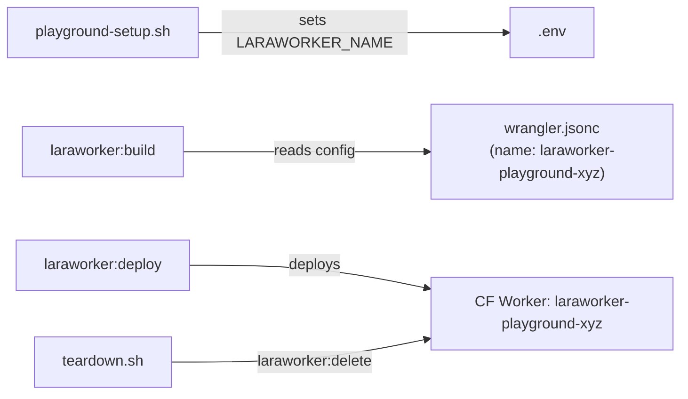

# Epic: Isolated playground deployments with automatic cleanup (e-fb1dfd)

## Goal

Prevent fuel agents (and local playground usage) from accidentally deploying over the production `laraworker` worker at `laraworker.kswb.dev`. Every playground gets a unique worker name, and teardown scripts automatically delete deployed workers from Cloudflare.

## Approach

The config layer already supports `LARAWORKER_NAME` env var (`config/laraworker.php:198`). Three changes:

1. **New `laraworker:delete` artisan command** — reads worker name from config, runs `npx wrangler delete --name <name>`, with safety guard refusing to delete `laraworker` (production).
2. **`playground-setup.sh` sets `LARAWORKER_NAME`** — appends a unique name (`laraworker-playground-<short-random>`) to the playground `.env` after install.
3. **Teardown scripts call `laraworker:delete`** — both `playground-teardown.sh` and `.fuel/teardown.sh` attempt worker deletion before removing files.



## Files to Modify

| File | Change |
|------|--------|
| `src/Console/DeleteCommand.php` | **New** — artisan command to delete a deployed worker |
| `src/LaraworkerServiceProvider.php` | Register the new `DeleteCommand` |
| `scripts/playground-setup.sh` | Append `LARAWORKER_NAME=laraworker-playground-<random>` to `.env` |
| `scripts/playground-teardown.sh` | Call `laraworker:delete` before `rm -rf` |
| `.fuel/teardown.sh` | Call `laraworker:delete` via playground artisan if playground exists |
| `tests/Feature/DeleteCommandTest.php` | **New** — test the delete command |

## Task Breakdown

### Task 1: `laraworker:delete` artisan command (simple)

Create `src/Console/DeleteCommand.php`:
- Signature: `laraworker:delete {--force : Skip confirmation}`
- Reads worker name from `config('laraworker.worker_name')`
- **Safety guard**: refuses to delete if name is `laraworker` (production) unless `--force` is passed with explicit confirmation
- Reads `account_id` from `config('laraworker.account_id')` and passes to wrangler if set
- Runs `npx wrangler delete --name <worker-name>` from the build directory (or base path)
- Streams output like `DeployCommand` does
- Handles gracefully: worker doesn't exist (not an error), wrangler not authenticated (clear error message)
- Register in `LaraworkerServiceProvider` alongside existing commands

Mirror patterns from `DeployCommand.php`: Process class, output streaming, wrangler auth check.

### Task 2: `playground-setup.sh` sets unique `LARAWORKER_NAME` (trivial)

After `laraworker:install` completes (line 44), append to playground `.env`:

```bash
# Generate unique playground worker name
PLAYGROUND_ID=$(head -c 4 /dev/urandom | xxd -p)
echo "" >> "$PLAYGROUND_DIR/.env"
echo "LARAWORKER_NAME=laraworker-playground-${PLAYGROUND_ID}" >> "$PLAYGROUND_DIR/.env"
```

This gives names like `laraworker-playground-a3f1b2c9` — unique per setup, clearly not production.

### Task 3: Teardown scripts delete deployed workers (simple)

**`scripts/playground-teardown.sh`** — before `rm -rf`:
```bash
# Attempt to delete deployed worker (best-effort, don't fail teardown)
if [ -f "$PLAYGROUND_DIR/artisan" ]; then
    echo "Attempting to delete deployed worker..."
    php "$PLAYGROUND_DIR/artisan" laraworker:delete --force --no-interaction 2>/dev/null || true
fi
```

**`.fuel/teardown.sh`** — same pattern:
```bash
PROJECT_PATH="${FUEL_PROJECT_PATH:-.}"
PLAYGROUND_DIR="$PROJECT_PATH/playground"

if [ -d "$PLAYGROUND_DIR" ] && [ -f "$PLAYGROUND_DIR/artisan" ]; then
    echo "Cleaning up deployed worker..."
    php "$PLAYGROUND_DIR/artisan" laraworker:delete --force --no-interaction 2>/dev/null || true
fi

# Then run playground teardown
if [ -d "$PLAYGROUND_DIR" ]; then
    "$PROJECT_PATH/scripts/playground-teardown.sh"
fi
```

Both are best-effort (`|| true`) — teardown must not fail if no worker was deployed or wrangler is not authenticated.

### Task 4: Tests for DeleteCommand (simple)

Test file: `tests/Feature/DeleteCommandTest.php`

Test cases:
- Command is registered and callable
- Refuses to delete `laraworker` without `--force` (safety guard)
- Calls wrangler with correct `--name` argument (mock Process)
- Handles missing wrangler gracefully

Follow patterns from existing command tests.

## Edge Cases

- **No deployment happened**: `wrangler delete` on a non-existent worker returns non-zero. The delete command should handle this gracefully (warn, don't error).
- **No wrangler auth**: Best-effort in teardown. The delete command itself should surface the auth error clearly.
- **Production guard**: Hardcoded protection against deleting `laraworker` worker name. This is the production marketing site.
- **`account_id` not set**: Wrangler may prompt or fail. Pass `--name` explicitly so it doesn't need to read wrangler.jsonc.

## Testing Strategy

- **Unit/Feature tests**: DeleteCommand with mocked Process (like DeployCommand patterns)
- **Smoke test**: After playground-setup, verify `.env` contains `LARAWORKER_NAME=laraworker-playground-*`
- **Manual verification**: Run `playground-setup.sh`, inspect generated `wrangler.jsonc` name field

## Acceptance Criteria

- `php artisan laraworker:delete` deletes the deployed CF Worker by name
- `laraworker:delete` refuses to delete worker named `laraworker` without explicit `--force`
- `playground-setup.sh` writes a unique `LARAWORKER_NAME` to `.env`
- Generated `wrangler.jsonc` uses the `LARAWORKER_NAME` value (not `laraworker`)
- `playground-teardown.sh` calls `laraworker:delete` before removing files
- `.fuel/teardown.sh` calls `laraworker:delete` before cleanup
- Teardown scripts do not fail if no worker was deployed
- All tests pass: `vendor/bin/pest --compact`

## Implementation Notes
<!-- Tasks: append discoveries, decisions, gotchas here -->
- **Task 3 COMPLETED** (f-2fc91c): Teardown scripts now call `laraworker:delete` before cleanup. Both scripts use `|| true` to ensure teardown never fails if the command doesn't exist or wrangler isn't authenticated. This is important because the delete command may not be implemented yet (Task 1 is still open).

## Interfaces Created
<!-- Tasks: document interfaces/contracts created -->
- **Teardown contract**: Both teardown scripts expect `laraworker:delete --force --no-interaction` to exist and be callable. The command should:
  - Accept `--force` to skip confirmation
  - Accept `--no-interaction` for non-interactive mode
  - Return 0 on success or non-zero on failure (teardown will ignore failures)
